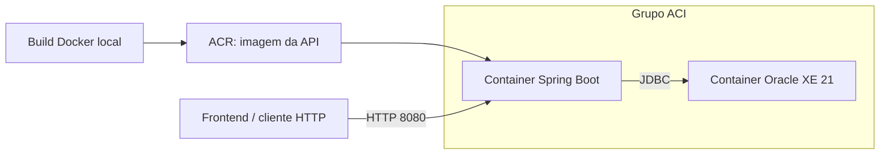

# ClyvoCare API

API REST para cadastrar tutores, pets e planos de saúde, simular preços e acompanhar contratações. Construída em Spring Boot com Oracle, faz parte do Challenge FIAP 2026, turma 2TDSPG.

Com ela, você pode consultar o catálogo de planos, contratar um plano para um pet e acompanhar seu status. Esta API complementa a [API .NET](https://github.com/ClyvoPet-Challenge-2026/.Net-Sprint-1), responsável pela parte de clínicas veterinárias do projeto.

A proposta é reunir o cadastro do tutor, seus pets e suas contratações no mesmo fluxo. Para o tutor, isso permite consultar os planos ativos e seus valores. Para a administração, permite acompanhar contratações, alterar planos e registrar pausas ou encerramentos.

## Como os projetos se complementam

O ClyvoCare está dividido em repositórios que atendem a partes diferentes da solução e das entregas do Challenge:

| Projeto | Papel |
|---|---|
| [API Java](https://github.com/ClyvoPet-Challenge-2026/Java-Sprint-1) | Cadastro de tutores, pets e planos; autenticação; simulação e gestão de contratações |
| [API .NET](https://github.com/ClyvoPet-Challenge-2026/.Net-Sprint-1) | Cadastro e consulta de clínicas veterinárias, com leitura de estados e cidades compartilhados |
| [Clyvo-Care — mobile](https://github.com/ClyvoPet-Challenge-2026/Clyvo-Care) | Versão mobile das entregas, com a apresentação visual voltada à experiência do aplicativo |
| [ClyvoCare Web](https://github.com/ClyvoPet-Challenge-2026/Java-Sprint-1-Web) | Camada de visualização em React e Vite criada para demonstrar os fluxos exigidos em Java Advanced |

As APIs Java e .NET trabalham com partes complementares do domínio. A Java mantém os estados e as cidades; a .NET consulta essas tabelas pelo Entity Framework e vincula as clínicas às cidades existentes. Para compartilhar esses dados, configure as duas APIs para usar o mesmo schema Oracle.

Na versão atual da .NET, estão implementados o CRUD de clínicas e as consultas de estados e cidades. Eventos clínicos e lembretes fazem parte do escopo previsto para essa API, mas ainda não têm endpoints implementados.

Para conhecer a versão mobile e sua apresentação visual, acesse o repositório **Clyvo-Care**. As instruções de frontend deste README são para o **ClyvoCare Web**, a interface de apoio à entrega de Java Advanced. As duas interfaces correspondem a entregas distintas: frontend em Java Advanced e aplicativo em Mobile Application Development, conforme o enunciado da Sprint 3.

## Como executar

Você pode rodar a API na sua máquina usando o Oracle da FIAP ou publicar a API e um Oracle próprio na Azure. Para desenvolver localmente, siga os passos abaixo. Para preparar o ambiente de DevOps da Sprint 3, siga [Deploy no Azure ACR + ACI](#deploy-no-azure-acr--aci).

Para rodar a API na sua máquina, você precisa de:

- **JDK 17 ou superior**, com `JAVA_HOME` configurado.
- **Acesso a um banco Oracle**, com usuário e senha. Você pode usar o Oracle da FIAP com as credenciais da sua conta.
- **Git**, para clonar o repositório.

O Maven Wrapper já está incluído. Você não precisa instalar o Maven separadamente. Docker e Azure CLI só são necessários para o deploy descrito mais abaixo.

### Configurando a conexão

Clone o projeto e entre na pasta:

```bash
git clone https://github.com/ClyvoPet-Challenge-2026/Java-Sprint-1.git
cd Java-Sprint-1
```

Defina a conexão no mesmo terminal em que você vai iniciar a aplicação. Substitua os valores de usuário e senha pelos da sua conta Oracle.

No **Bash ou Git Bash**:

```bash
export SPRING_DATASOURCE_URL='jdbc:oracle:thin:@oracle.fiap.com.br:1521:ORCL'
export SPRING_DATASOURCE_USERNAME='SEU_USUARIO'
export SPRING_DATASOURCE_PASSWORD='SUA_SENHA'
./mvnw spring-boot:run
```

No **PowerShell**:

```powershell
$env:SPRING_DATASOURCE_URL = 'jdbc:oracle:thin:@oracle.fiap.com.br:1521:ORCL'
$env:SPRING_DATASOURCE_USERNAME = 'SEU_USUARIO'
$env:SPRING_DATASOURCE_PASSWORD = 'SUA_SENHA'
.\mvnw.cmd spring-boot:run
```

Se você inicia a API pela IDE, configure essas mesmas variáveis na configuração de execução. Para usar outro Oracle, ajuste também a URL JDBC.

As credenciais acima conectam a aplicação ao banco. O login da interface usa os usuários cadastrados em `TB_CAD_OWNER`, apresentados na próxima seção.

### O que acontece ao iniciar

Na execução normal, o Flyway aplica as migrations pendentes antes de o Hibernate validar as tabelas. Em um schema vazio da aplicação, ele cria a estrutura e carrega os dados de demonstração. Você não precisa executar o script SQL manual.

Se o schema já tem tabelas, leia [Banco de dados e migrations](#banco-de-dados-e-migrations): o projeto usa baseline para trabalhar com bancos existentes.

Depois da inicialização, os endereços são:

| Endereço | Uso |
|---|---|
| `http://localhost:8080` | Base da API |
| `http://localhost:8080/swagger-ui.html` | Documentação interativa |
| `http://localhost:8080/v3/api-docs` | Contrato OpenAPI em JSON |

A raiz da API não é uma página de apresentação. Para navegar pelos fluxos da entrega de Java Advanced, inicie também a interface web descrita abaixo. As instruções da versão mobile ficam no repositório [Clyvo-Care](https://github.com/ClyvoPet-Challenge-2026/Clyvo-Care).

### Acessando a camada de visualização de Java Advanced

Em outro terminal, clone o [ClyvoCare Web](https://github.com/ClyvoPet-Challenge-2026/Java-Sprint-1-Web). Essa interface React/Vite consome a API Java para demonstrar login, pets e contratações. Você precisa de Node.js compatível com o Vite atual do projeto, por exemplo Node 22.12 ou superior, e npm.

```bash
git clone https://github.com/ClyvoPet-Challenge-2026/Java-Sprint-1-Web.git
cd Java-Sprint-1-Web
cp .env.example .env
```

No PowerShell, você pode usar `Copy-Item .env.example .env`. No arquivo `.env`, configure:

```dotenv
VITE_API_BASE_URL=http://localhost:8080
```

Depois, instale as dependências e inicie a interface:

```bash
npm install
npm run dev
```

Acesse `http://localhost:5173`. As contas de demonstração são:

| E-mail | Senha inicial | Perfil |
|---|---|---|
| `ana@email.com` | `senha123` | `ADMIN` |
| `carlos@email.com` | `senha123` | `OWNER` |

A carga preserva senhas já personalizadas. A senha acima vale para contas criadas pela carga e para os placeholders antigos corrigidos pela V3.

Na interface, você encontra o cadastro de pets, a simulação e contratação de planos e a página **Meus planos**, que mostra as contratações ativas dos seus pets. O perfil `ADMIN` também tem acesso à gestão de status das contratações.

O CORS permite `http://localhost:5173` e `http://localhost:3000` por padrão. Se você usar outro endereço ou porta, defina `CORS_ALLOWED_ORIGINS` na API com a origem exata do frontend. Para mais de uma origem, separe os endereços por vírgula.

## Banco de dados e migrations

As migrations ficam em [src/main/resources/db/migration](src/main/resources/db/migration). Na execução normal, elas controlam a estrutura e a carga inicial; o Hibernate usa `ddl-auto=validate` para conferir se o banco corresponde às entidades.

| Migration | Responsabilidade |
|---|---|
| `V1__create_baseline_schema.sql` | Cria a estrutura inicial, com 15 tabelas |
| `V2__subscription_enums.sql` | Converte status e pagamento para texto, remove duas tabelas auxiliares e atualiza funções, procedimentos e trigger |
| `V3__seed_demo_data.sql` | Inclui os dados de demonstração ausentes e corrige as contas legadas de Ana e Carlos |

Após a V2, o schema tem 13 tabelas de aplicação. Ele inclui `TB_CAD_CLINIC`, usada pela API .NET, e as tabelas de eventos clínicos e lembretes previstas para a evolução dessa área. A existência dessas tabelas não significa que todos os respectivos endpoints já estejam implementados.

### Usando um banco que já tem dados

Com `spring.flyway.baseline-on-migrate=true`, um schema preenchido e ainda sem histórico do Flyway recebe um baseline na versão 1. Nesse caso, a V1 é considerada anterior ao ponto de partida e as migrations seguintes são aplicadas.

Isso pressupõe que as tabelas existentes sejam compatíveis com o modelo esperado. O baseline não reconstrói uma estrutura incompleta. A V2 trata algumas diferenças legadas, como a ausência de `ROLE_NAME` e `ENABLED`, e interrompe a conversão se encontrar status ou pagamentos sem correspondência.

O Flyway registra as versões aplicadas em `flyway_schema_history`. Reiniciar a API não repete a carga já registrada. Para alterar uma migration aplicada, crie uma nova versão; editar V1 ou V2 muda o checksum que o Flyway usa para validar o histórico.

### Como os dados de demonstração são carregados

A V3 inclui estados, cidades, espécies, raças, planos e dois usuários. Ela procura cada registro por seus campos de identificação, como UF, nome ou e-mail, sem depender de IDs fixos. Assim, também consegue completar tabelas parcialmente preenchidas.

Nos registros existentes, a migration preserva os cadastros e preços. Para as contas de demonstração, ela:

- Substitui somente `hash1` de Ana e `hash2` de Carlos por BCrypt de `senha123`.
- Ajusta Ana para `ADMIN` e Carlos para `OWNER`.
- Preserva outras senhas e a situação de habilitação das contas existentes.

O `DataInitializer` fica como alternativa para ambientes com Flyway explicitamente desabilitado, como o script ACI atual. A propriedade `app.seed.enabled=false` desativa essa alternativa Java; ela não desativa a V3.

### Script SQL e objetos de banco

[script_bd.sql](script_bd.sql) e [docs/script.sql](docs/script.sql) são os scripts completos da entrega de Database. Eles contêm criação de tabelas, dados e PL/SQL, incluindo comandos de exclusão de tabelas. **Você não precisa executá-los para iniciar a API com Flyway.**

O diagrama de modelagem está em [docs/MER.png](docs/MER.png). Entre os objetos de banco estão:

| Objeto | Uso |
|---|---|
| `FN_SUBSCRIPTION_TO_JSON` | Monta o JSON de uma contratação com seus relacionamentos |
| `FN_CALCULATE_CONTRACT_VALUE` | Calcula o valor do plano conforme o pagamento |
| `SP_REPORT_SUBSCRIPTIONS_JSON` | Exibe contratações em JSON, com filtro de status |
| `SP_REPORT_REVENUE_FACT` | Exibe valores agrupados por plano e status, com subtotais |
| `TRG_SUBSCRIPTION_AUDIT` | Registra inclusões, alterações e exclusões de contratações |

O cálculo usado pela API está em `ContractPricingService`. A função SQL mantém as mesmas taxas para uso no banco; o serviço Java não chama essa função.

## Autenticação e permissões

Para obter um token, envie e-mail e senha:

```http
POST /auth/login
Content-Type: application/json

{
  "email": "carlos@email.com",
  "password": "senha123"
}
```

A resposta contém um campo `token`. Copie o valor e envie nas próximas requisições:

```http
Authorization: Bearer <token>
```

O JWT vale por 30 minutos e é assinado com RSA (RS256). As chaves incluídas em `src/main/resources/keys` são de demonstração. As senhas são armazenadas com BCrypt, e o login também verifica se a conta está habilitada.

Use `GET /auth/me` para consultar os dados do usuário autenticado. O cadastro público em `POST /responsaveis` cria contas com perfil `OWNER`.

| Recurso | Consulta | Criação | Edição e exclusão |
|---|---|---|---|
| Responsáveis | `ADMIN` | Pública | `ADMIN` |
| Pets | Usuário autenticado | `ADMIN` ou `OWNER` | `ADMIN` ou `OWNER` |
| Contratações | Usuário autenticado | `ADMIN` ou `OWNER` | `ADMIN` |
| Estados, cidades, espécies, raças e planos | Usuário autenticado | `ADMIN` | `ADMIN` |

A simulação aceita `ADMIN` e `OWNER`. Mudança de status e troca de plano exigem `ADMIN`. O Swagger e o login são públicos; as demais consultas exigem token.

A consulta `GET /contratacoes/minhas` filtra pelo usuário do JWT e retorna somente seus planos ativos. Nas rotas gerais de pets e contratações, a implementação atual não restringe os registros ao dono do token: o filtro usado nas telas de tutor não substitui essa validação no backend.

## Fluxos de contratação

### Simular e contratar um plano

Primeiro, consulte `GET /planos` e escolha um plano. Os IDs variam conforme o banco, então use os valores retornados pela API nos exemplos abaixo.

```http
POST /contratacoes/simulacao
Authorization: Bearer <token>
Content-Type: application/json

{
  "planId": 1,
  "paymentMethod": "PIX"
}
```

A simulação devolve o valor base, a taxa de desconto, o desconto em reais e o valor final. Ela não cria uma contratação.

| Pagamento | Valor enviado na API | Desconto |
|---|---|---|
| Pix | `PIX` | 5% |
| Cartão de débito | `DEBIT_CARD` | 3% |
| Cartão de crédito | `CREDIT_CARD` | Sem desconto |
| Boleto | `BOLETO` | Sem desconto |

Por exemplo, um plano de R$ 69,90 pago por Pix fica em R$ 66,41. O serviço arredonda o valor final para duas casas e calcula o desconto em reais pela diferença, R$ 3,49 nesse caso.

Para confirmar, envie também o pet:

```http
POST /contratacoes
Authorization: Bearer <token>
Content-Type: application/json

{
  "petId": 1,
  "planId": 1,
  "paymentMethod": "PIX"
}
```

A API consulta o preço novamente, calcula o valor e cria a contratação com status `ACTIVE`. O frontend não define o preço final nem o status inicial.

Um pet só pode receber uma contratação ativa por esses fluxos. Se já houver outra, a API responde `409 Conflict`. Depois de contratar, você pode consultar `GET /contratacoes/minhas` ou abrir **Meus planos** na interface.

### Pausar, encerrar ou trocar um plano

O administrador pode alterar o status com `PATCH /contratacoes/{id}/status`:

```json
{
  "status": "PENDING"
}
```

As transições permitidas são:

| Status atual | Pode mudar para |
|---|---|
| `ACTIVE` — ativo | `PENDING` ou `INACTIVE` |
| `PENDING` — pendente ou pausado | `ACTIVE` ou `INACTIVE` |
| `INACTIVE` — encerrado | Nenhum |

Repetir o status atual ou tentar reativar uma contratação encerrada retorna `409`. Para um pet cujo contrato foi encerrado, você pode criar outra contratação.

A troca de plano usa `POST /contratacoes/{id}/troca-plano`:

```json
{
  "planId": 2,
  "paymentMethod": "DEBIT_CARD"
}
```

Se você omitir `paymentMethod` ou enviar `null`, o pagamento atual é mantido. A operação recalcula o preço e preserva pet, status e data de início.

O `PUT /contratacoes/{id}` também recalcula o preço, recebe `petId`, `planId` e `paymentMethod`, e preserva o status. Tanto o PUT quanto a troca de plano aceitam somente contratações ativas ou pendentes.

## Endpoints

O contrato completo, com campos e respostas, está no Swagger. Esta tabela reúne os recursos para você localizar as operações:

| Rota base | Recurso | Listagem |
|---|---|---|
| `/responsaveis` | Tutores | Paginada |
| `/pets` | Pets | Paginada |
| `/contratacoes` | Contratações | Paginada |
| `/estados` | Estados | Lista |
| `/cidades` | Cidades | Lista |
| `/especies` | Espécies | Lista |
| `/racas` | Raças | Lista |
| `/planos` | Catálogo de planos | Lista |

Esses recursos têm `POST` e `GET` na rota base, além de `GET`, `PUT` e `DELETE` em `/{id}`, conforme as permissões descritas acima.

As rotas específicas são:

| Método | Rota | Uso |
|---|---|---|
| `POST` | `/auth/login` | Obter o token |
| `GET` | `/auth/me` | Consultar o usuário do token |
| `GET` | `/contratacoes/minhas` | Listar os planos ativos dos pets do usuário, com paginação |
| `POST` | `/contratacoes/simulacao` | Simular o valor |
| `PATCH` | `/contratacoes/{id}/status` | Alterar o status |
| `POST` | `/contratacoes/{id}/troca-plano` | Trocar o plano |
| `GET` | `/formas-pagamento` | Consultar os valores de pagamento aceitos |
| `GET` | `/status-contratacao` | Consultar os status aceitos |

Status e formas de pagamento são enums. Suas rotas retornam listas fixas e não têm cadastro, edição ou exclusão.

### Cadastro de pet

Para cadastrar, informe o ID do tutor e da espécie. A raça é opcional:

```json
{
  "name": "Rex",
  "birthDate": "2020-03-10",
  "sex": "MALE",
  "ownerId": 1,
  "speciesId": 1,
  "breedId": null
}
```

Envie esse corpo para `POST /pets`, com o token. Você obtém seu próprio `ownerId` em `GET /auth/me` e os IDs de espécies e raças em suas respectivas consultas.

A data de nascimento não pode estar no futuro. Sexo aceita `MALE` ou `FEMALE`, e os IDs informados devem ser positivos.

### Filtros e paginação

As páginas começam em zero. Você pode combinar os filtros do recurso com `page`, `size` e `sort`:

```http
GET /responsaveis?name=ana&page=0&size=10&sort=name,asc
GET /pets?ownerId=2&speciesId=1&page=0&size=10
GET /contratacoes?petId=1&status=ACTIVE
GET /contratacoes/minhas?page=0&size=6&sort=id,desc
```

| Recurso | Filtros disponíveis |
|---|---|
| Responsáveis | `name`, `cpf`, `email` |
| Pets | `name`, `ownerId`, `speciesId`, `breedId` |
| Contratações | `petId`, `planId`, `status`, `paymentMethod` |

As respostas paginadas trazem os registros em `content` e informações como `totalElements`, `totalPages` e `last`.

## Consultando e verificando a API

### Swagger, Insomnia ou curl

O Swagger permite consultar o contrato e enviar requisições às rotas públicas. A configuração atual não declara o esquema Bearer na documentação, então não há botão **Authorize** para informar o token. Para chamar as rotas protegidas, use Insomnia ou curl.

A coleção [docs/clyvo-care-api.yaml](docs/clyvo-care-api.yaml) tem os ambientes **Base Environment**, para localhost, e **Azure ACI**. Ajuste `base_url` para o endereço da API e execute o login da pasta `00 - Autenticacao`. O script da requisição salva o JWT em `access_token`.

As pastas seguintes agrupam consultas, cadastros, simulação, contratação e mudanças de status. Os cadastros de responsável, pet e contratação guardam os IDs retornados para as próximas requisições. Alguns exemplos de catálogo usam IDs fixos; confira se existem no seu banco antes de executá-los.

Se preferir curl, faça o login:

```bash
curl -i -X POST http://localhost:8080/auth/login \
  -H 'Content-Type: application/json' \
  -d '{"email":"carlos@email.com","password":"senha123"}'
```

Copie o token da resposta e use-o na consulta:

```bash
curl -i http://localhost:8080/contratacoes/minhas \
  -H 'Authorization: Bearer COLE_O_TOKEN_AQUI'
```

Esses exemplos usam Bash. No PowerShell, use `curl.exe` e escreva cada comando em uma linha.

### Testes disponíveis

O teste Java existente, `ClyvoCareApiApplicationTests`, verifica a inicialização do contexto Spring. Ele usa a configuração de banco da aplicação, portanto depende de um Oracle acessível e pode aplicar migrations durante a inicialização. Ainda não há uma suíte de testes unitários das regras de contratação.

Para executá-lo, use `./mvnw test` ou `.\mvnw.cmd test`.

O script `azure-acr-aci-test.sh` faz verificações HTTP de documentação, login, consultas e cadastro de tutor e pet. Ele cria dados no ambiente informado. Você pode passar a URL explicitamente:

```bash
bash azure-acr-aci-test.sh http://SEU_FQDN:8080
```

## Deploy no Azure ACR + ACI

Este é o fluxo usado para a entrega de **DevOps Tools & Cloud Computing da Sprint 3**, na opção **ACR + ACI**: a aplicação e o banco rodam em containers na nuvem. O script [azure-acr-aci-setup.sh](azure-acr-aci-setup.sh) cria os recursos via Azure CLI, publica a imagem da API no Azure Container Registry e sobe um grupo no Azure Container Instances com dois containers: a API e um Oracle XE 21.

Para executar esse fluxo, você precisa de:

- **Azure CLI** instalada e uma **assinatura Azure ativa**.
- **Docker Desktop aberto e usando containers Linux**, no Windows, ou Docker Engine em execução no Linux.
- **Bash ou Git Bash**, com os comandos `az`, `docker` e `curl` disponíveis.
- O repositório clonado na sua máquina, conforme [Configurando a conexão](#configurando-a-conexão).

Abra o terminal na raiz do repositório, onde ficam o `Dockerfile` e o script. Confira se o Docker está respondendo e selecione a assinatura que vai receber os recursos:

```bash
docker info
az login
az account set --subscription "NOME_OU_ID_DA_ASSINATURA"
az account show --query "{assinatura:name, id:id}" -o table
```

Se `docker info` falhar, aguarde o Docker Desktop terminar de iniciar antes de continuar. O build usa as imagens de Maven e Java definidas no Dockerfile; você não precisa gerar o JAR manualmente para esse deploy.

Depois, execute:

```bash
bash azure-acr-aci-setup.sh
```

O script faz o seguinte:

1. Confere o login no Azure e registra os provedores `Microsoft.ContainerRegistry` e `Microsoft.ContainerInstance`, quando necessário.
2. Cria o **Resource Group** e um **ACR** na assinatura selecionada.
3. Autentica o Docker no ACR, faz o **build da API na sua máquina** e envia a imagem com `docker push`.
4. Gera o arquivo `aci-deployment.generated.yaml`, com as imagens, portas e variáveis de conexão.
5. Cria o **grupo ACI**. A Azure baixa a imagem da API do ACR e a imagem `gvenzl/oracle-xe:21-slim` para iniciar o banco.
6. Consulta o IP e o endereço público e aguarda a API responder em `/v3/api-docs`, com até 60 tentativas e intervalo de 10 segundos.

O Docker Desktop participa do build e do envio da imagem. Depois do provisionamento, os containers da aplicação e do banco executam na Azure.

### Nomes e configurações do ambiente

O script usa estes valores por padrão:

| Variável | Valor padrão | Uso |
|---|---|---|
| `RESOURCE_GROUP` | `rg-clyvocare-sprint3` | Grupo que reúne os recursos |
| `LOCATION` | `mexicocentral` | Região de criação |
| `CONTAINER_GROUP_NAME` | `aci-clyvocare-group` | Grupo com a API e o Oracle |
| `ACR_NAME` | `acrclyvo` seguido de um sufixo aleatório | Nome do registro de imagens |
| `DNS_LABEL` | `clyvocare-api-` seguido de um sufixo aleatório | Parte inicial do endereço público |

Para personalizar os nomes, exporte as variáveis no mesmo terminal antes de executar o script. Use uma região disponível para sua assinatura. Você também pode definir `ORACLE_PWD`, `APP_DB_USER` e `APP_DB_PWD` para configurar as credenciais do Oracle desse ambiente.

Esse processo inclui a inicialização de um Oracle próprio no ACI. As variáveis `SPRING_DATASOURCE_*` usadas na execução local com o banco da FIAP não são reaproveitadas pelo script: ele define a conexão do container com o Oracle do grupo. Para desenvolver, você pode continuar rodando a API localmente com o banco da FIAP, sem repetir todo o provisionamento a cada alteração.

### Como o ambiente é organizado



O grupo expõe as portas **8080** e **1521**. A API acessa o Oracle por `127.0.0.1:1521/XEPDB1`, dentro do mesmo grupo.

O [Dockerfile](Dockerfile) usa duas etapas: Maven com JDK 23 para gerar o JAR e JRE 23 para executá-lo. O projeto compila para Java 17. O container da API roda como `appuser`, UID `10001`, e o build da imagem usa `-DskipTests`.

### Diferenças em relação à execução local

**O script ACI atual desabilita o Flyway.** Ele injeta estas variáveis no container da API:

```yaml
SPRING_FLYWAY_ENABLED: "false"
SPRING_JPA_HIBERNATE_DDL_AUTO: "update"
```

Com isso, o Hibernate cria ou altera as tabelas, e o `DataInitializer` tenta carregar os dados de demonstração. As migrations V1, V2 e V3, incluindo os objetos PL/SQL, não são executadas nesse deploy.

O script também cria o usuário `clyvocare`, mas conecta a API como `system`, usando `ORACLE_PWD`. Ao consultar as tabelas para conferir dados criados pela API, considere esse schema; o usuário anunciado no resumo do script é `APP_DB_USER`.

O banco não tem volume persistente configurado nesse manifesto. Trate os dados desse ambiente como temporários. A execução local com Flyway e a inicialização pelo script ACI seguem configurações diferentes; o deploy ainda precisa ser alinhado às migrations.

### Endereço e logs

Com os nomes padrão do script, você pode recuperar o endereço a qualquer momento:

```bash
az container show --resource-group rg-clyvocare-sprint3 --name aci-clyvocare-group --query ipAddress.fqdn -o tsv
```

Use `http://FQDN_RETORNADO:8080` como base da API. O Swagger fica em `/swagger-ui.html`. Se você alterar `RESOURCE_GROUP` ou `CONTAINER_GROUP_NAME`, use esses mesmos nomes nos comandos de consulta.

Para acompanhar os logs da API:

```bash
az container logs --resource-group rg-clyvocare-sprint3 --name aci-clyvocare-group --container-name clyvocare-api --follow
```

Para os logs do banco, troque o nome do container por `oracle-db`. A resposta de `/v3/api-docs` confirma acesso à documentação, mas não substitui a verificação do login e dos fluxos com gravação no banco.

### Conferindo a entrega de DevOps

Com a API respondendo no endereço público, execute as verificações HTTP:

```bash
bash azure-acr-aci-test.sh http://SEU_FQDN:8080
```

Esse script verifica documentação, login, consultas e cadastro de tutor e pet. Para demonstrar o CRUD completo exigido na Sprint 3, use também a coleção do Insomnia ou os endpoints descritos neste README para criar, consultar, editar e excluir **pets e contratações**. Essas duas tabelas fazem parte do negócio e estão relacionadas pelo pet da contratação. Prepare pelo menos dois registros significativos em cada uma e exclua as contratações antes dos pets usados no teste.

Para conferir os dados diretamente no Oracle do ACI, abra uma conexão no SQL Developer ou em outro cliente Oracle:

| Campo | Valor |
|---|---|
| Host | IP público ou FQDN retornado pelo script |
| Porta | `1521` |
| Tipo de conexão | Service name |
| Serviço | `XEPDB1` |
| Usuário | `system`, usado pela API no manifesto atual |
| Senha | Valor de `ORACLE_PWD` usado no provisionamento |

Consulte as tabelas após cada operação da API:

```sql
SELECT * FROM TB_CAD_PET;
SELECT * FROM TB_CAD_SUBSCRIPTION;
```

O DDL comentado está em [script_bd.sql](script_bd.sql). Como explicado na seção de banco, esse arquivo também contém comandos de exclusão de tabelas; as consultas acima bastam para conferir a persistência durante a demonstração.

No vídeo de DevOps, comece pelo clone do repositório, mostre a criação dos recursos pelo script e execute o CRUD usando a API publicada. Mostre os `SELECT` no banco sem cortes durante a comprovação das operações, com resolução mínima de 720p e explicação por voz. O PDF da entrega deve conter somente os nomes e RMs dos integrantes e os links do GitHub e do vídeo no YouTube.

### Removendo os recursos

Quando terminar de usar o ambiente, você pode solicitar sua exclusão:

```bash
bash azure-cleanup.sh
```

Esse script **apaga o grupo de recursos inteiro**, incluindo o ACR e os containers. Ele usa o grupo `rg-clyvocare-sprint3` por padrão ou o valor de `RESOURCE_GROUP`. A exclusão é iniciada em segundo plano, sem confirmação interativa.

## Tecnologias utilizadas

| Ferramenta | Papel |
|---|---|
| Java 17 e Spring Boot 4.0.6 | Linguagem e estrutura da aplicação |
| Spring Web MVC | Rotas HTTP |
| Spring Data JPA e Hibernate | Persistência no Oracle |
| Flyway e módulo Oracle | Versionamento do banco |
| Spring Security e OAuth2 Resource Server | Login e validação de JWT |
| BCrypt | Hash das senhas |
| Bean Validation | Validação dos campos de entrada |
| Spring Cache | Cache de consultas de estados e cidades |
| SpringDoc OpenAPI 3.0.2 | Documentação Swagger |
| Lombok | Geração de construtores, acessores e builders |
| Maven | Dependências e compilação |
| Docker, ACR e ACI | Empacotamento e deploy |

As versões e dependências estão em [pom.xml](pom.xml). Embora existam dependências de H2 no arquivo, a configuração de execução usa Oracle.

## Estrutura e decisões de implementação

O código está organizado por camada. Para acompanhar uma requisição, comece no controller, siga para o service e depois para o repository:

```text
src/main/
├── java/br/com/fiap/ClyvoCareAPI/
│   ├── auth/          login, emissão de JWT e regras de segurança
│   ├── config/        CORS, OpenAPI e carga alternativa sem Flyway
│   ├── controller/    endpoints e respostas HTTP
│   ├── service/       regras de negócio e transações
│   ├── repository/    consultas e persistência com JPA
│   ├── entity/        mapeamento das tabelas e enums
│   ├── dto/           contratos de entrada e saída
│   └── validation/    tratamento dos erros de validação
└── resources/
    ├── application.properties
    ├── db/migration/  V1, V2 e V3
    └── keys/          chaves RSA de demonstração
```

Os DTOs são records que separam o JSON das entidades. Os controllers recebem os DTOs de entrada, chamam os serviços e convertem os resultados em DTOs de resposta. Os serviços recebem as requisições tipadas e trabalham com entidades para aplicar as regras e persistir os dados.

A lógica de preço fica em `ContractPricingService`, compartilhada pela simulação, criação, edição e troca de plano. As transições de status ficam em `SubscriptionLifecycleService`. Isso mantém o cálculo e as transições no mesmo lugar para todas essas operações.

As alterações de contratação usam transações e bloqueios dos registros envolvidos. A verificação de outra contratação ativa é feita com o pet bloqueado, evitando que duas operações concorrentes criem ou ativem contratos para ele ao mesmo tempo.

Estados e cidades têm cache nas consultas, invalidado nas alterações. As chaves estrangeiras continuam protegidas pelo Oracle, e os serviços também consultam os registros relacionados para devolver `404` quando uma referência não existe.

O `ValidationHandler` devolve erros de campos como uma lista de objetos `{field, message}`. Para `ResponseStatusException`, retorna `{status, message}`. Por isso, ao tratar erros no frontend, você precisa considerar os dois formatos.

O modelo Oracle compartilhado mantém a referência entre as clínicas da API .NET e as cidades cadastradas pela API Java. O Oracle do ACI é uma instância própria, separada do banco da FIAP; as APIs só consultam os mesmos registros quando suas conexões apontam para o mesmo schema no mesmo banco.

Outros arquivos úteis:

| Arquivo | Conteúdo |
|---|---|
| [docs/clyvo-care-api.yaml](docs/clyvo-care-api.yaml) | Coleção Insomnia |
| [docs/MER.png](docs/MER.png) | Diagrama do banco |
| [script_bd.sql](script_bd.sql) | Script completo da entrega de Database |
| [azure-acr-aci-setup.sh](azure-acr-aci-setup.sh) | Provisionamento ACR + ACI |
| [azure-acr-aci-test.sh](azure-acr-aci-test.sh) | Verificações HTTP no ambiente informado |
| [azure-cleanup.sh](azure-cleanup.sh) | Exclusão dos recursos Azure |
| [azure-setup.sh](azure-setup.sh) | Script da Sprint 1, baseado em VM |

## Relação com a Sprint 3

| Disciplina | Onde encontrar a implementação |
|---|---|
| Java Advanced — frontend | Camada de visualização [ClyvoCare Web](https://github.com/ClyvoPet-Challenge-2026/Java-Sprint-1-Web), em React/Vite: login, pets, contratação, meus planos e gestão de status |
| Java Advanced — Flyway | Migrations V1, V2 e V3 na execução normal |
| Java Advanced — Spring Security | Perfis `ADMIN` e `OWNER`, JWT e permissões nos endpoints |
| Java Advanced — fluxos de negócio | Simulação e contratação; mudança de status e troca de plano |
| DevOps | Dockerfile e scripts de build, publicação, provisionamento e verificação no ACR + ACI |
| Database | Modelagem, scripts SQL, funções, procedimentos e trigger |
| .NET | [API complementar](https://github.com/ClyvoPet-Challenge-2026/.Net-Sprint-1), com clínicas, consultas de localização, observabilidade e projetos de testes |
| Mobile Application Development | Versão mobile das entregas no repositório [Clyvo-Care](https://github.com/ClyvoPet-Challenge-2026/Clyvo-Care) |

Para demonstrar o versionamento do banco, use a execução com Flyway habilitado. Para demonstrar o deploy ACI, considere as diferenças documentadas na seção de Azure. A verificação completa da entrega também depende de executar os fluxos e apresentar as evidências exigidas pela disciplina.
